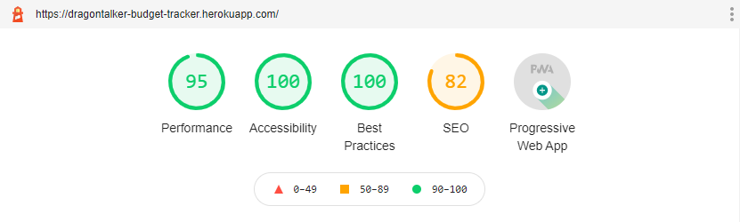
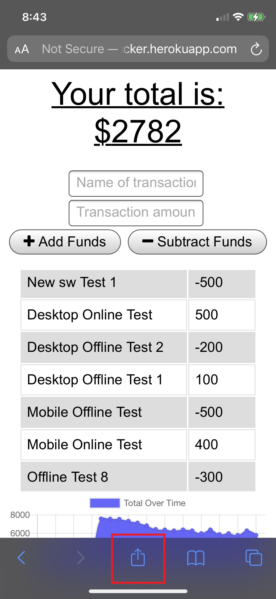
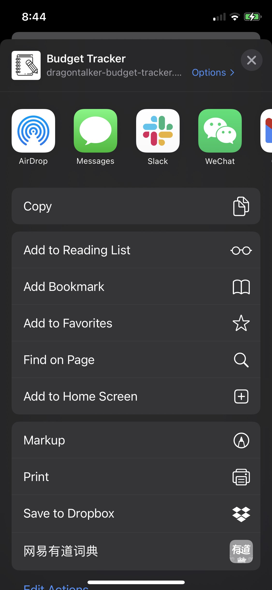
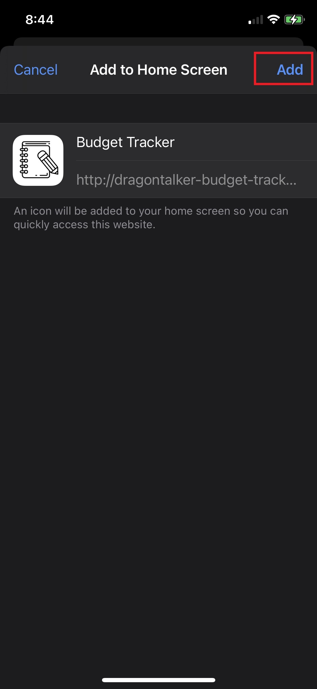
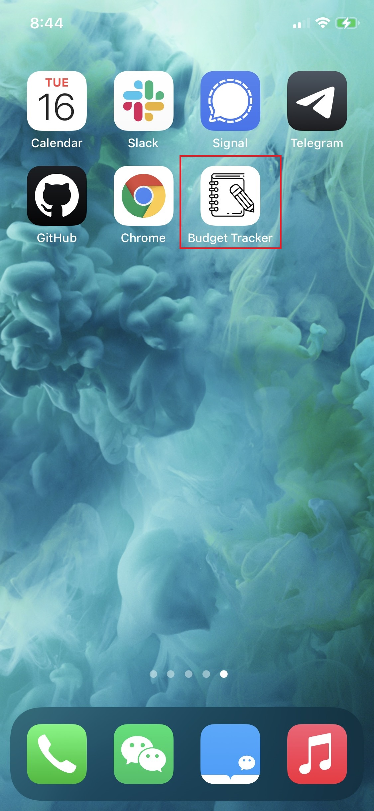
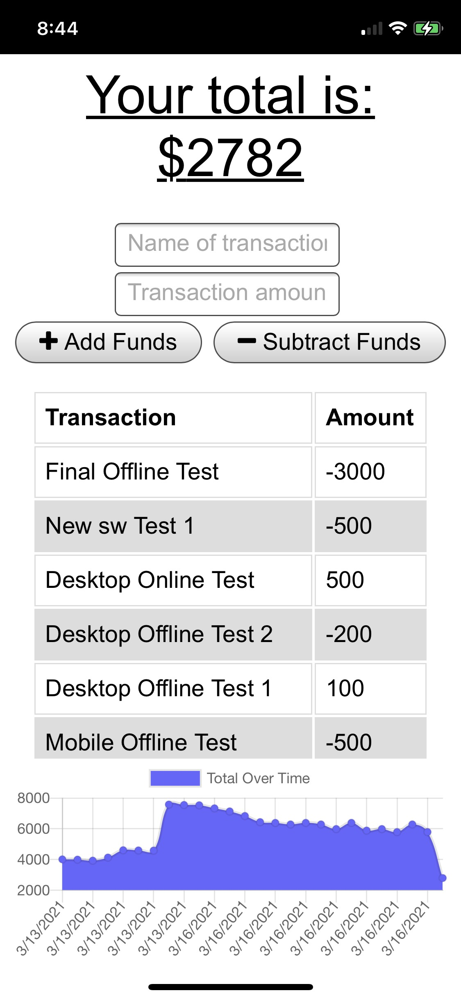

# **Budget Tracker**

[](#) [](#) [](#) [](#) [](#)

### :rocket: **Deployed on Heroku**

https://dragontalker-budget-tracker.herokuapp.com/

---

### **Table of Contents**

- [Description](#description)
- [How to Use](#how-to-use)
- [How to Install](#how-to-install)
- [License](#license)
- [Author Info](#author-info)

# Description

:mag_right: Embrace the future of PWA (Progressive Web Application)! We built a budget tracker following the standard of PWA, which means it works on mobile devices just like native APPs. By that, it does have the following important features.

- First, it can be installed on your home screen, and once you start the PWA from home screen, it works in fullscreen mode which gives you the same user experience as native APPs.

- Second, it doesn't depends on network connections. If your device is offline or having unstable connections, this PWA still stores all your data and sync them when the device is back online.

[Back to the Top](#budget-tracker)

## **Certification of PWA(Progressive Web Aapplication)**



[Back to the Top](#budget-tracker)

## :wrench: **Technologies Used**

- Service Worker
- IndexDB
- Chrome DevTools
- Express.js
- Node.js
- RESTful Api
- MongoDB
- Mongoose
- Bootstrap 5
- HTML 5
- CSS 3
- JavaScript
- VS Code
- Heroku

[Back to the Top](#budget-tracker)

# How to Use

:crystal_ball: To install this application as a PWA on your mobile device, follow the steps below:

## **Step 1**

Head to https://dragontalker-budget-tracker.herokuapp.com/, then click the export button.



[Back to the Top](#budget-tracker)

## **Step 2**

Click on option `Add to Home Screen`.



[Back to the Top](#budget-tracker)

## **Step 3**

Click on option `Add`.



[Back to the Top](#budget-tracker)

## **Step 4**

Now the PWA is install on your home screen, you can open it from there.



[Back to the Top](#budget-tracker)

## **Step 5**

Enjoy your PWA just like any other native APPs!



[Back to the Top](#budget-tracker)

## **Usage**

Enter name and dollar amount for each transaction you want to record, the transaction history and budget graph will be updated accordingly.

[Back to the Top](#budget-tracker)

# How to Install

:cd: For local installtion, use the following command:

```bash
npm install
```

Then open the application in your brower at http://localhost:3000.

[Back to the Top](#budget-tracker)

### **Contact**

If you have any questions, email me at richard.yang.tong@gmail.com.

### **License**

Copyright (c) [2021] [Richard Yang]

Permission is hereby granted, free of charge, to any person obtaining a copy of this software and associated documentation files (the "Software"), to deal in the Software without restriction, including without limitation the rights to use, copy, modify, merge, publish, distribute, sublicense, and/or sell copies of the Software, and to permit persons to whom the Software is furnished to do so, subject to the following conditions:

The above copyright notice and this permission notice shall be included in all copies or substantial portions of the Software.

THE SOFTWARE IS PROVIDED "AS IS", WITHOUT WARRANTY OF ANY KIND, EXPRESS OR IMPLIED, INCLUDING BUT NOT LIMITED TO THE WARRANTIES OF MERCHANTABILITY, FITNESS FOR A PARTICULAR PURPOSE AND NONINFRINGEMENT. IN NO EVENT SHALL THE AUTHORS OR COPYRIGHT HOLDERS BE LIABLE FOR ANY CLAIM, DAMAGES OR OTHER LIABILITY, WHETHER IN AN ACTION OF CONTRACT, TORT OR OTHERWISE, ARISING FROM, OUT OF OR IN CONNECTION WITH THE SOFTWARE OR THE USE OR OTHER DEALINGS IN THE SOFTWARE.
