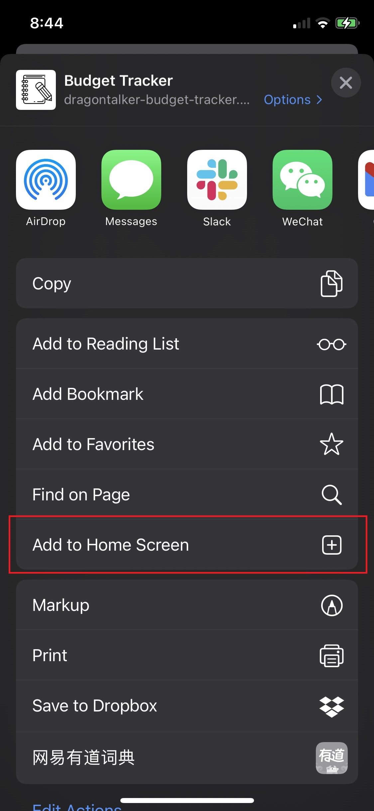

# __PWA - Budget Tracker__

## __Deployed at Heroku__
https://dragontalker-budget-tracker.herokuapp.com/

---

## __Certification of PWA(Progressive Web Aapplication)__

---

## __Table of Contents__
* [Description](#Description)
* [Installation](#Installation)
* [Usage](#Usage)
* [Contact](#Contact)
* [License](#License)

---

### __Description__

Embrace the future of PWA (Progressive Web Application)! We built a budget tracker following the standard of PWA, which means it works on mobile devices just like native APPs. By that, it does have the following important features. 

* First, it can be installed on your home screen, and once you start the PWA from home screen, it works in fullscreen mode which gives you the same user experience as native APPs. 

* Second, it doesn't depends on network connections. If your device is offline or having unstable connections, this PWA still stores all your data and sync them when the device is back online.

---

### __User Story__
* AS AN avid traveller
* I WANT to be able to track my withdrawals and deposits with or without a data/internet connection
* SO THAT my account balance is accurate when I am traveling

---

### __Business Context__

Giving users a fast and easy way to track their money is important, but allowing them to access that information anytime is even more important. Having offline functionality is paramount to our applications success.

---

### __Acceptance Criteria__
GIVEN a user is on Budget App without an internet connection
WHEN the user inputs a withdrawal or deposit
THEN that will be shown on the page, and added to their transaction history when their connection is back online.

---

### __Installation__

To install the PWA on your mobile device, please follow the instruction and check the area highlighted by red boxes. The example here demonstrates the steps for installation on IOS devices.

##### __Step 1__

Head to https://dragontalker-budget-tracker.herokuapp.com/, then click the export button.

##### __Step 2__

Click on option `Add to Home Screen`.

##### __Step 3__

Click on option `Add`.

